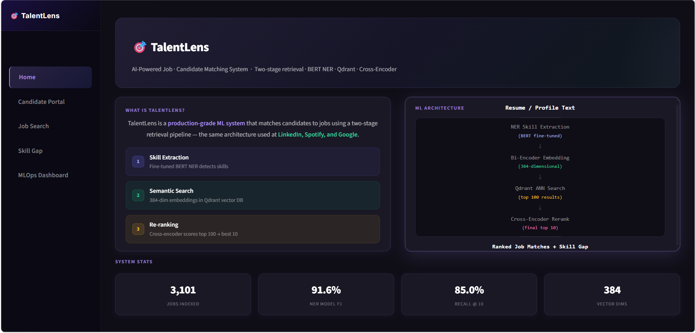
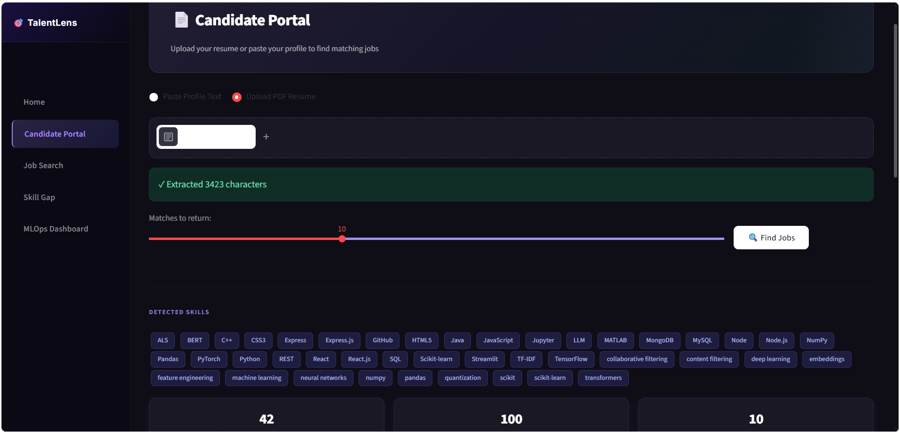
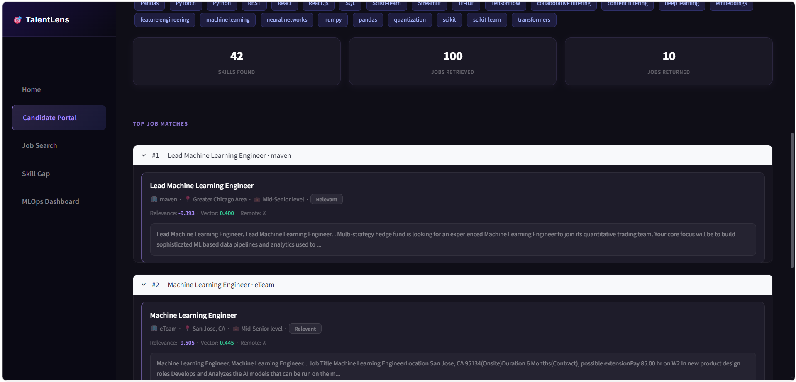
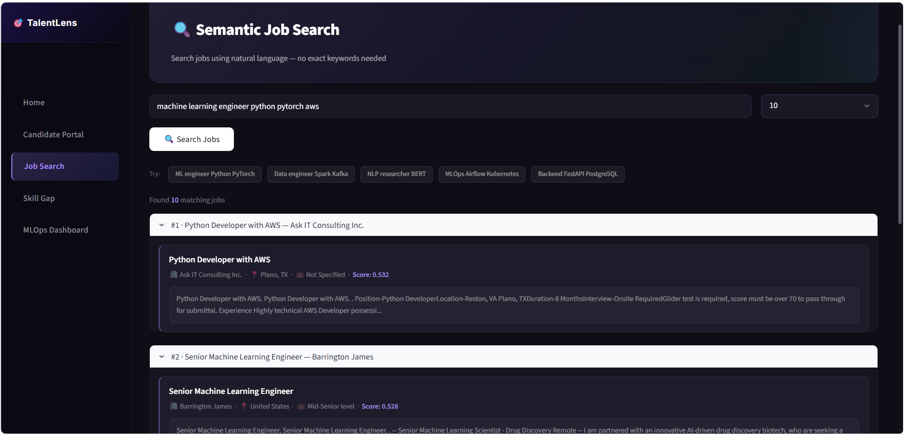
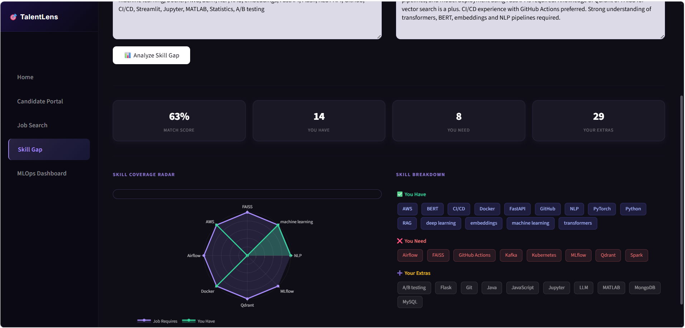
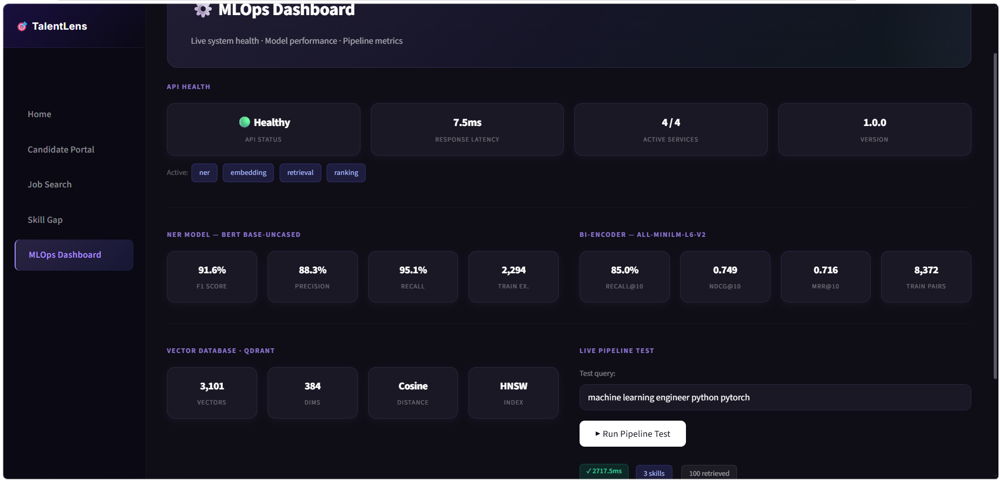
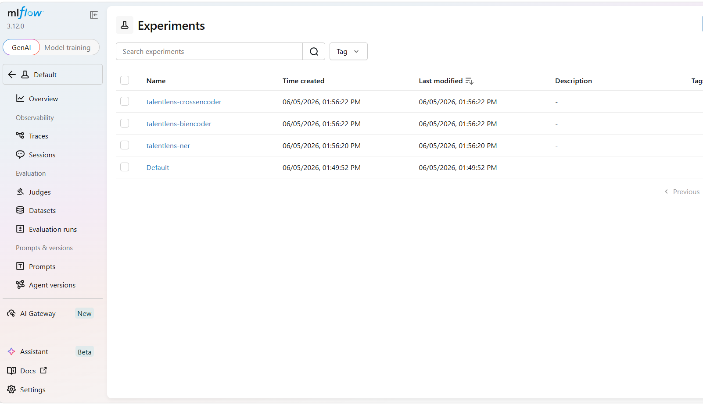
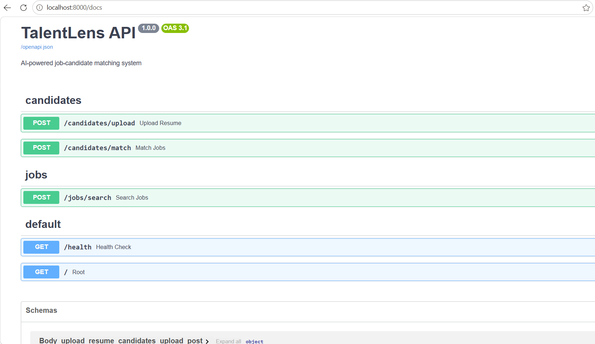
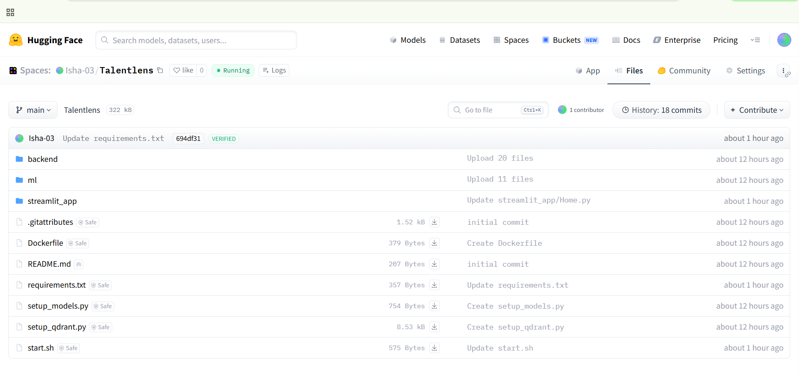

# 🎯 TalentLens — AI-Powered Job Matching System

A production-grade, end-to-end **ML system** that matches candidates to jobs using a **two-stage retrieval pipeline** — fine-tuned BERT for skill extraction, bi-encoder embeddings in Qdrant vector DB, and cross-encoder re-ranking — deployed on Hugging Face Spaces with a full MLOps stack.

## Live Demo

👉 **https://huggingface.co/spaces/Isha-03/Talentlens**

---

##  How It Works

This system uses a **4-stage ML pipeline**:

| Stage | Technology | Role |
|-------|-----------|------|
|  Skill Extraction | Fine-tuned BERT NER | Extracts skills from resumes and job descriptions |
|  Embedding | Bi-Encoder (all-MiniLM-L6-v2) | Converts text to 384-dim semantic vectors |
|  Retrieval | Qdrant Vector DB (HNSW) | ANN search retrieves top-100 matching jobs |
|  Re-ranking | Cross-Encoder (MiniLM) | Scores each pair, returns final top-10 |

---

##  Features

-  **Semantic Job Matching** — upload resume PDF or paste profile, get ranked job matches instantly
-  **Skill Extraction** — hybrid BERT NER + dictionary matching detects 40+ skills from any resume
-  **Skill Gap Analysis** — radar chart comparing your skills vs job requirements
-  **Semantic Search** — natural language job search without exact keyword matching
-  **MLOps Dashboard** — live API health, model metrics, Qdrant stats, pipeline latency
-  **Experiment Tracking** — MLflow tracking for NER, bi-encoder, and cross-encoder runs

---

##  Model Performance

| Model | Metric | Score |
|-------|--------|-------|
| NER (BERT fine-tuned) | F1 Score | **91.6%** |
| NER (BERT fine-tuned) | Precision | **88.3%** |
| NER (BERT fine-tuned) | Recall | **95.1%** |
| Bi-Encoder (MiniLM) | Recall@10 | **85.0%** |
| Bi-Encoder (MiniLM) | NDCG@10 | **0.749** |
| Bi-Encoder (MiniLM) | MRR@10 | **0.716** |
| Training Data | Job Postings | **3,101 real LinkedIn jobs** |
| Training Pairs | Bi-Encoder | **8,372 synthetic pairs** |

---

##  System Architecture

```
Resume / Profile Text
        ↓
BERT NER  →  Skill Extraction
        ↓
Bi-Encoder  →  384-dim Embedding
        ↓
Qdrant HNSW  →  Top-100 Retrieval
        ↓
Cross-Encoder  →  Re-ranked Top-10
        ↓
Ranked Job Matches + Skill Gap Analysis
```

## 🛠️ Tech Stack

| Category | Tools |
|----------|-------|
| Language | Python 3.11 |
| ML Framework | PyTorch, Hugging Face Transformers |
| Embeddings | Sentence Transformers (all-MiniLM-L6-v2) |
| NER Model | BERT base-uncased (fine-tuned) |
| Re-ranking | Cross-Encoder (ms-marco-MiniLM-L-6-v2) |
| Vector DB | Qdrant (HNSW index, Cosine similarity) |
| Backend | FastAPI + Uvicorn + Pydantic v2 |
| Frontend | Streamlit + Plotly |
| MLOps | MLflow (experiment tracking + model registry) |
| PDF Parsing | PyMuPDF |
| Deployment | Hugging Face Spaces + Docker |
| Data | LinkedIn Job Postings (Kaggle, 123K+ raw) |

---

##  Key ML Concepts

- **Two-Tower Bi-Encoder** — same architecture used at LinkedIn and Spotify for candidate matching
- **Contrastive Learning** — MultipleNegativesRankingLoss (InfoNCE) for embedding training
- **Hard Negative Mining** — improves embedding space quality during bi-encoder training
- **Approximate Nearest Neighbor** — HNSW index in Qdrant for fast vector search
- **Cross-Encoder Re-ranking** — accurate pairwise relevance scoring on top-100 retrieved results
- **Weak Supervision** — dictionary-based NER training data creation from 3,101 job postings
- **Hybrid Skill Extraction** — BERT NER combined with 200+ skill dictionary matching
- **Two-Stage Retrieval Pipeline** — fast ANN retrieval followed by accurate re-ranking

---

## 📊 Screenshots

#### Home Page


#### Candidate Portal — Skills Detected


#### Candidate Portal — Job Matches


#### Job Search


#### Skill Gap Analysis


#### MLOps Dashboard


#### MLflow Experiment Tracking


#### FastAPI Documentation


#### Live on Hugging Face Spaces


---

## 🗃️ Dataset

| Dataset | Size | Purpose |
|---------|------|---------|
| LinkedIn Job Postings (Kaggle) | 123,849 raw jobs | Source data |
| After filtering (tech roles) | 3,101 jobs | Training and indexing |
| NER training examples | 2,294 examples | BERT NER fine-tuning |
| Bi-encoder training pairs | 8,372 pairs | Embedding training |

